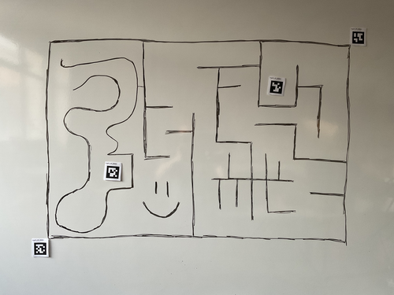
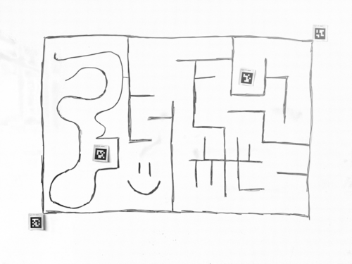
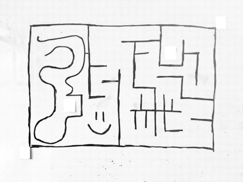
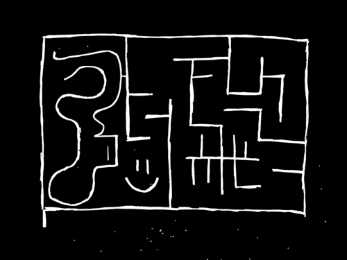
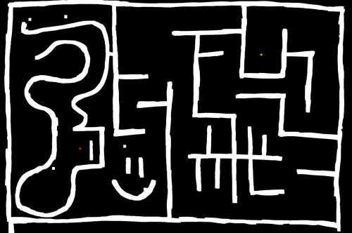
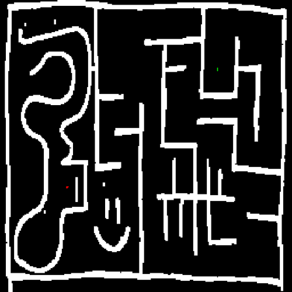
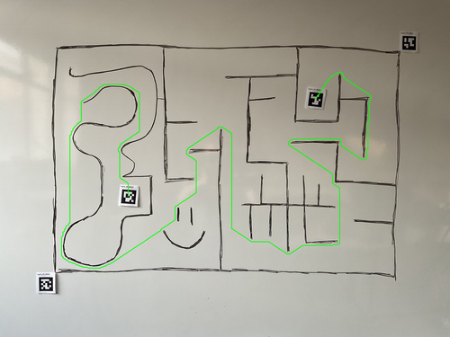

# Algorithm Explanation

- Step 001: Load the image

    

- Step 002: Normalize the image

    

- Step 003: Erode the image

    

- Step 004: Threshold the image

    

- Step 005: Dilate the image

    

- Step 006: Crop the image

    

- Step 007: Show the maze with start and end points

    

- Step 008: Create the maze bitmap

    

- Step 009: Find the maze path

    

- Step 010: Show the solution

    

