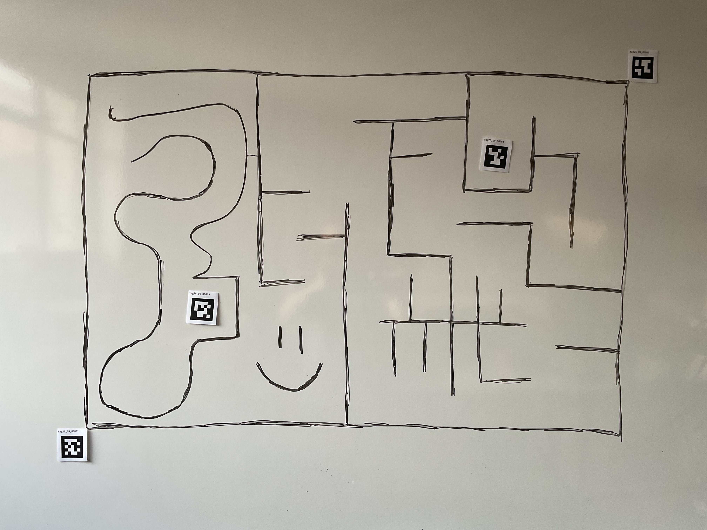
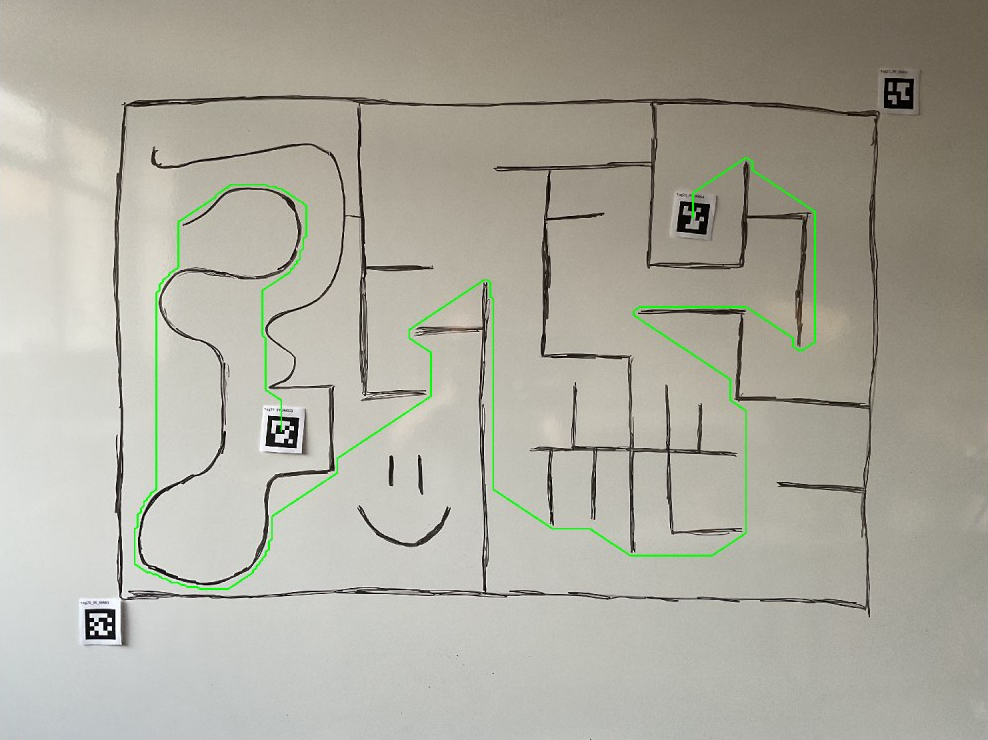

# OpenCV Maze Solver

<p align="center">
   
   
</p>

This is a simple maze solver using OpenCV and Python. The maze is solved using the A* algorithm from the NetworkX library.

**Markers** This project uses apriltag markers (from the family [`tag25h9`](https://github.com/AprilRobotics/apriltag-imgs/tree/master/tag25h9)) to detect the start and end points of the maze. Here is the meaning of each tag:

- `tag25_09_00001`, `tag25_09_00002`: are used to detect boundaries of the maze.

- `tag25_09_00003` tells the start point of the maze.

- `tag25_09_00004` tells the end point of the maze.

## Installation

This project uses Poetry for dependency management. To install the dependencies, run the following command:

```bash
poetry install
```

## Usage

### Image

To run the maze solver, use the following command:

```bash
poetry run python main.py --image <image_path>
```

Replace `<image_path>` with the path to the maze image you want to solve like `images/IMG_0867.jpg`.


### Camera

To run the maze solver using the camera, use the following command:

```bash
poetry run python main_camera.py
```